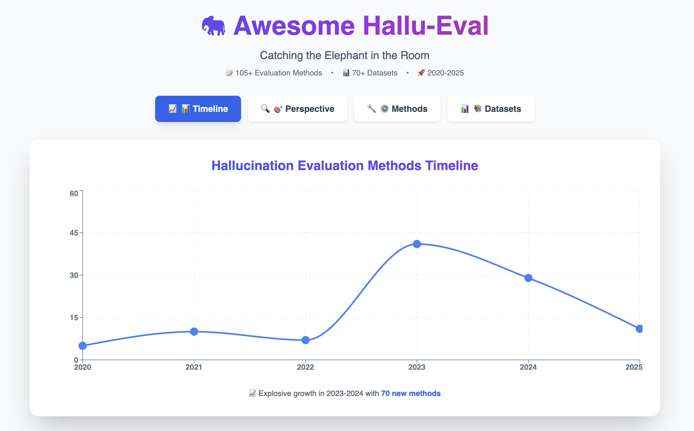

# Awesome-Hallu-Eval: Can we catch the Elephant?




📊 👆 **[View Interactive Visualization](https://siyaqi.github.io/Awesome-Hallu-Eval/)**

---

This is a curated list of evaluators designed to assess model hallucination. Here, you can easily find the right tools you need to evaluate and analyze hallucination behavior in language models.

Hallucinations can no longer remain the elephant in the room, they must be actively hunted down and captured.


> 📖 **Survey:** For comprehensive analysis, detailed comparisons of evaluation methods, and future trends, please check out our survey paper:
> **[A Survey of Automatic Hallucination Evaluation on Natural Language Generation](https://arxiv.org/pdf/2404.12041)**


> 📢 **Update:** This repository is updated irregularly to catch up with the latest research. If you encounter relevant papers not listed here, contributions and contact are warmly welcome ❤️ !

<br>


## 📚 Dataset & Benchmark

### 🟦 Traditional Task-Specific
| Dataset | Task | Size | Label Type | Links |
| :--- | :--- | :--- | :--- | :--- |
| **DialogueNLI** | Dialogue | 343k pairs | Entailment/contradiction/neutral | [GitHub](https://wellecks.com/dialogue_nli/) |
| **CoGenSumm** | Summarization | 100 articles | Sentence correct/incorrect | [Dataset](https://tudatalib.ulb.tu-darmstadt.de/items/9a3612a3-4fba-400f-8b23-bf1e917d894f) |
| **XSumFaith** | Summarization | 500 articles | Span intrinsic/extrinsic hallucination | [GitHub](https://github.com/google-research-datasets/xsum_hallucination_annotations) |
| **QAGS** | Summarization | 474 articles | Consistent/inconsistent | [GitHub](https://github.com/W4ngatang/qags) |
| **Polytope** | Summarization | 1.5k summaries | Intrinsic/extrinsic hallucination | [GitHub](https://github.com/hddbang/PolyTope) |
| **FRANK** | Summarization | 2.25k summaries | Entity, discourse, grammar errors | [GitHub](https://github.com/artidoro/frank) |
| **Falsesum** | Summarization | 2.97k articles | Consistent/inconsistent | [GitHub](https://github.com/joshuabambrick/Falsesum) |
| **FactEval** | Dial. Summ. | 150 dialogues | Consistent/inconsistent | [GitHub](https://github.com/BinWang28/FacEval) |
| **Text Simplification** | Text Simplification | 1.56k pairs | Insertion/deletion/substitution | [GitHub](https://github.com/AshOlogn/Evaluating-Factuality-in-Text-Simplification) |
| **NonFactS** | Augmented Summ. | 400k samples | Non-factual summaries | [GitHub](https://github.com/ASoleimaniB/NonFactS) |
| **RefMatters** | Dial. Summ. | 4k pairs | FRANK errors | [GitHub](https://github.com/kite99520/DialSummFactCorr) |
| **DiaHalu** | Dial. Gen. | 1.0k samples | Dialogue-level factuality | [GitHub](https://github.com/ECNU-ICALK/DiaHalu) |
| **TofuEval** | Dial. Summ. | 1.5k pairs | Consistent/inconsistent | [GitHub](https://github.com/amazon-science/tofueval) |
| **RAGTruth** | RAG systems | 2.97k samples | Evident/subtle conflict/baseless | [GitHub](https://github.com/ParticleMedia/RAGTruth) |
| **SummaCoz** | Summarization | 6.07k summaries | Explanation | [HF Dataset](https://huggingface.co/datasets/nkwbtb/SummaCoz) |
| **FaithBench** | Summarization | 750 samples | Questionable/benign/unwanted | [GitHub](https://github.com/vectara/FaithBench) |

### 🟩 General Factuality
| Dataset | Task | Size | Label Type | Links |
| :--- | :--- | :--- | :--- | :--- |
| **Q2** | Dialogue QA | 750 samples | Consistent/inconsistent | [GitHub](https://github.com/orhonovich/q-squared/tree/main) |
| **HADES** | Free-form Gen | 34k instances | Token-level hallucination | [GitHub](https://github.com/yizhe-zhang/HADES) |
| **TruthfulQA** | Truthfulness QA | 817 pairs | QA truthfulness | [GitHub](https://github.com/sylinrl/TruthfulQA) |
| **FACTOR** | Multi-choice | 4.27k samples | FRANK errors | [GitHub](https://github.com/AI21Labs/factor) |
| **HaluEval** | QA/Summ/Dial | 35K samples | Hallucinations yes/no | [GitHub](https://github.com/RUCAIBox/HaluEval) |
| **PHD** | Passage QA | 300 entities | Factual/non-factual/unverifiable | [GitHub](https://github.com/maybenotime/PHD) |
| **FAVA** | General queries | 200 queries | Entity/relation/contradictory/invented | [Project Page](https://fine-grained-hallucination.github.io/) |
| **THaMES** | General QA | 2.1k samples | Correct/hallucinated | [GitHub](https://github.com/holistic-ai/THaMES) |
| **HELM** | Continue Gen | 1.2k passages | Hallucination/non-hallucination | [GitHub](https://github.com/oneal2000/MIND/tree/main) |
| **HalluLens** | LLM Gen | 130k instances | Intrinsic/extrinsic/factuality | [GitHub](https://github.com/facebookresearch/HalluLens) |
| **FreshLLMs** | Time-sensitive QA | 599 pairs | Fast/slow/never changing | [GitHub](https://github.com/freshllms/freshqa) |
| **ERBench** | KB LLM QA | - | Binary/multi-choice | [GitHub](https://github.com/DILAB-KAIST/ERBench) |
| **KOLA** | KB LLM Gen | 2.15k samples | Correct/incorrect | [GitHub](https://github.com/thu-keg/kola) |
| **RealtimeQA** | Real-time Gen | 4.3k pairs | Correct/retrieval error | [GitHub](https://github.com/realtimeqa/realtimeqa_public) |
| **FactBench** | Dynamic Eval | Growing | Factually Correct/Incorrect | [GitHub](https://github.com/f-bayat/FactBench) |
| **SimpleQA** | Short Factuality | 2k prompts | Factual / Not Factual | [HF Dataset](https://huggingface.co/datasets/basicv8vc/SimpleQA) |

### 🟧 Application & Domain Specific
| Dataset | Task | Size | Label Type | Links |
| :--- | :--- | :--- | :--- | :--- |
| **FactScore** | Biography | 6.5k samples | Support/unsupport | [GitHub](https://github.com/shmsw25/FActScore) |
| **BAMBOO** | Long-context | 1.5k samples | SenHallu, AbsHallu | [GitHub](https://github.com/RUCAIBox/BAMBOO) |
| **ChineseFactEval** | Chinese Multi | 125 prompts | Factual/non-factual | [Project Page](https://gair-nlp.github.io/ChineseFactEval/) |
| **HalluQA** | Chinese QA | 450 questions | Misleading/knowledge | [GitHub](https://github.com/OpenMOSS/HalluQAEval) |
| **UHGEval** | Chinese News | 5k samples | Hallucination/non-hallucination | [GitHub](https://github.com/IAAR-Shanghai/UHGEval) |
| **ANAH** | Gen (CN/EN) | 4.3k gen | Contradictory/unverifiable | [GitHub](https://github.com/open-compass/ANAH) |
| **HalOmi** | Translation | 18 langs | Hallucination, omission | [GitHub](https://github.com/facebookresearch/stopes/tree/main/demo/halomi) |
| **Chinese SimpleQA** | Chinese QA | 10k questions | Correct/Incorrect/Refusal | [GitHub](https://github.com/he-yancheng/Chinese-SimpleQA) |
| **C-FAITH** | Chinese Summ | 4k summaries | Span-level annotation | [GitHub](https://github.com/PKU-YuanGroup/C-FAITH) |
| **Bi'an** | RAG (EN/ZH) | 5.2k triplets | Supported/Not Supported | [GitHub](https://github.com/NJUNLP/Bian) |
| **HalluVerse25** | Multi-ling QA | 12.5k samples | Binary + fine-grained | [HF Dataset](https://huggingface.co/papers/2503.07833) |
| **Poly-FEVER** | Multi-ling Fact | ~185k claims | Supported/Refuted/NEI | [HF Dataset](https://huggingface.co/datasets/HanzhiZhang/Poly-FEVER) |
| **MASSIVE** | Multi-ling AMR | 1M utterances | Semantic fidelity (Smatch) | [GitHub](https://github.com/alexa/massive) |
| **MultiHal** | KG-QA (8 langs) | 4.8k questions | Consistent/Inconsistent | [HF Dataset](https://huggingface.co/datasets/ernlavr/multihal) |
| **K-HALU** | Korean QA | 3.5k questions | Correct/Hallucinated | [GitHub](https://github.com/jaehyung-seo/k-halu) |
| **MedHalt** | Medical | 25.64k samples | Groundedness/hallucination | [Project Page](https://medhalt.github.io/) |
| **MedHallu** | Medical QA | 10k samples | Hard/medium/easy | [Project Page](https://medhallu.github.io/) |
| **LegalHallu** | Legal QA | 745k samples | Correctness/groundedness | [HF Dataset](https://huggingface.co/datasets/reglab/legal_hallucinations) |
| **SUMMEDITS** | Multi-domain | 6.35k samples | Consistent/inconsistent | [HF Dataset](https://huggingface.co/datasets/Salesforce/summeditsl) |
| **DefAn** | Cross-domain | 3k questions | Factual/Hallucinated | [GitHub](https://github.com/saeed-anwar/DefAn-Benchmark) |
| **HalluMix** | Detection | 7.7k examples | Binary | [GitHub](https://github.com/deanna-emery/HalluMix) |
| **ToolBeHonest** | Tool-use | 700 samples | Missing/potential/limited tools | [GitHub](https://github.com/ToolBeHonest/ToolBeHonest) |
| **RoleBench** | Role-Play | 2k instances | In/Out-of-Character | [HF Dataset](https://huggingface.co/datasets/ZenMoore/RoleBench) |
| **Molecular Mirage** | Molecular QA | 1.1k questions | Binary | [GitHub](https://github.com/H-ovi/Molecular-Mirage) |
| **Collu-Bench** | Code Gen | 1.2k prompts | Likely to hallucinate | [GitHub](https://github.com/collu-bench/collu-bench) |
| **TIB** | Traffic QA | 2.5k pairs | No/Mild/Severe | [Paper](https://doi.org/10.18653/v1/2025.naacl-industry.4) |

### 🟨 Evaluate the Evaluators (Meta-Evaluation)
| Dataset | Task | Size | Label Type | Links |
| :--- | :--- | :--- | :--- | :--- |
| **Wizard of Wikipedia** | KB Dialogue | 22.3k dialogues | Knowledge selection | [Project Page](https://parl.ai/projects/wizard_of_wikipedia/) |
| **TopicalChat** | KB Dialogue | 10.79k dialogues | Knowledge source | [GitHub](https://github.com/alexa/Topical-Chat) |
| **SummEval** | Summ Metric | 1.6k summaries | Consistent/inconsistent | [GitHub](https://github.com/Yale-LILY/SummEval) |
| **BEAMetrics** | Multi-task | - | Coherence | [GitHub](https://github.com/ThomasScialom/BEAMetrics) |
| **CI‑ToD** | Task Dialogue | 3.19k dialogues | Consistent/inconsistent | [GitHub](https://github.com/yizhen20133868/CI-ToD) |
| **SummaC** | Summ Metric | - | Consistent/inconsistent | [GitHub](https://github.com/tingofurro/summac) |
| **BEGIN** | KB Dialogue | 12k turns | Attributable/generic | [GitHub](https://github.com/google/BEGIN-dataset) |
| **FaithDial** | Dialogue Eval | 5.65k dialogues | BEGIN, VRM | [HF Dataset](https://huggingface.co/datasets/McGill-NLP/FaithDial) |
| **DialSumMeval** | Dial. Summ. | 1.5k summaries | Consistent/inconsistent | [GitHub](https://github.com/kite99520/DialSummEval) |
| **TRUE** | Cross-task | ~200k samples | Consistent/inconsistent | [GitHub](https://github.com/google-research/true) |
| **AGGREFACT** | Summ Metric | 59.7k samples | Consistent/inconsistent | [HF Dataset](https://huggingface.co/datasets/lytang/LLM-AggreFact) |
| **FELM** | Multi-task | 847 samples | Factuality pos/neg | [GitHub](https://github.com/hkust-nlp/felm) |

---

## 🛠️ Hallucination Evaluation Methods

**Legend:**
* **SF (Source Faithfulness):** ✅ Checks if output is faithful to provided context.
* **WF (World Factuality):** ✅ Checks if output matches real-world knowledge.

### 🚀 After LLM Era
*Methods that rely on or utilize Large Language Models.*

| Name | Task | Model Basis | Method | Metric | SF | WF |
| :--- | :--- | :--- | :--- | :--- | :---: | :---: |
| **SCALE** | Long Dial. | Flan-T5 | NLI | Likelihood | ✅ | ❌ |
| **Chen et al.** | Summ | GPT-4/T5 | Vanilla/COT/Sent-Prompt | Balanced Acc | ✅ | ❌ |
| **GPTScore** | Summ/Dial | GPT-3 | Direct Assessment | Direct Score | ✅ | ❌ |
| **G-Eval** | Summ/Dial | GPT-4 | COT/Form-filling | Weighted Scores | ✅ | ❌ |
| **Wang et al.** | Summ/D2T | ChatGPT | Direct Assessment | Direct score | ✅ | ❌ |
| **ChainPoll** | Hallu Detect | GPT-3.5 | Direct Assessment | Accuracy | ✅ | ❌ |
| **EigenScore** | QA | LLaMA/OPT | Semantic Embedding | AUROC, PCC | ✅ | ❌ |
| **TruthfulQA** | QA | GPT-3 | Answer Match | Likelihood | ❌ | ✅ |
| **HaluEval** | QA/Summ | ChatGPT | Direct Assessment | Accuracy | ✅ | ✅ |
| **FACTOR** | Generation | - | FRANK Classification | Likelihood | ❌ | ✅ |
| **FELM** | Reasoning | GPT-4 | Direct Assessment | F1/Acc | ✅ | ✅ |
| **FreshQA** | Generation | - | Answer Match | Accuracy | ❌ | ✅ |
| **RealTimeQA** | Generation | GPT-3/T5 | Answer Match | Acc, F1 | ❌ | ✅ |
| **ERBench** | QA | - | String Matching | Hallu Rate | ❌ | ✅ |
| **FactScore** | Biography | GPT/ChatGPT | Binary Classification | Precision | ❌ | ✅ |
| **BAMBOO** | Multi-choice | ChatGPT | Answer Match | F1 | ✅ | ❌ |
| **MedHalt** | Medical | ChatGPT | Answer Match | Accuracy | ❌ | ✅ |
| **ChineseFactEval** | Generation | FacTool | Direct Score | Direct Score | ❌ | ✅ |
| **UHGEval** | News | GPT-4 | Answer Match | Similarity | ❌ | ✅ |
| **HalluQA** | Generation | GPT-4/GLM | Direct Assessment | Non-hallu Rate | ❌ | ✅ |
| **FacTool** | QA/Code | ChatGPT | Tool Querying | F1 | ✅ | ✅ |
| **UFO** | QA/RAG | GPT-3.5 | Fact Verification | Avg Sub-scores | ✅ | ✅ |
| **CONNER** | QA/Dial. | RoBERTa | 3-way NLI | Accuracy | ❌ | ✅ |
| **SelfCheckGPT** | Detection | GPT-3 | NLI/Ngram/QA | AUC-PR | ✅ | ❌ |
| **InterrogateLLM** | Detection | GPT-3/Llama | Query Consistency | AUC | ❌ | ✅ |
| **SAC³** | QA Gen | GPT-3.5 | Cross-checking | AUROC | ✅ | ✅ |
| **KoLA** | KB | - | Self-contrast | Similarity | ❌ | ✅ |
| **RV** | Generation | ChatGPT | Database Access | F1 | ✅ | ❌ |
| **SummEdits** | Summ | GPT-3.5 | Seed Verification | Balanced Acc | ✅ | ❌ |
| **LLM-Check** | Fact-check | Llama/GPT | Internal Attn/Logits | AUROC | ❌ | ✅ |
| **PHR** | ICL | Llama/Gemma | Bayesian Posterior | Hallu Rate | ✅ | ❌ |
| **HalluMeasure** | Summ | Claude | COT/Reasoning | F1 | ✅ | ❌ |
| **EGH** | QA/Summ | Llama/OPT | Embedding Diff | AUC/F1 | ✅ | ✅ |
| **STARE** | NMT | COMET/XNLI | Aggregate Scores | AUROC | ✅ | ❌ |
| **HaluAgent** | QA/Code | GPT-4 | Tool Selection | Acc/F1 | ✅ | ✅ |
| **RefChecker** | QA/RAG | GPT-4/NLI | Extractor & Checker | F1 | ✅ | ✅ |
| **HDM-2** | Gen | Qwen-2.5 | Classification | F1 | ✅ | ✅ |
| **Lookback Lens** | Summ/QA | Llama-2 | Attention Map | AUROC | ✅ | ✅ |
| **KnowHalu** | QA/Summ | Starling/GPT | Multi-form check | TPR/TNR | ✅ | ✅ |
| **AXCEL** | Summ/Gen | Llama/Claude | Direct Assessment | F1/AUC | ✅ | ✅ |
| **Drowzee** | QA | GPT/Llama | Direct Assessment | FCH Ratio | ❌ | ✅ |
| **MIND** | Writing | MLP | Embedding MLP | AUC | ❌ | ✅ |
| **BTProp** | Generation | Llama3 | Hidden Markov Tree | AUROC | ❌ | ✅ |
| **FAVA** | Retrieval | Llama2 | Tag Generation | F1 | ❌ | ✅ |
| **Semantic Entropy** | QA | Llama/Mistral | Semantic Entropy | AUROC | ❌ | ✅ |
| **SEPs** | QA | Llama/Phi | Semantic Probes | AUROC | ❌ | ✅ |
| **HaloScope** | QA | Llama/OPT | Unsupervised | AUROC | ❌ | ✅ |
| **LRP4RAG** | QA | Llama-2 | Internal State | F1 | ✅ | ✅ |
| **Halu-J** | Fact-check | GPT-4 | Reasoning | Accuracy | ❌ | ✅ |
| **NonFactS** | Summ | BART/RoBERTa | NLI | Balanced Acc | ✅ | ❌ |
| **MFMA** | Summ | BART/T5 | Classification | F1 | ✅ | ❌ |
| **HADEMIF** | QA | Llama2 | Hidden Calibration | ECE | ❌ | ✅ |
| **REDEEP** | RAG | Llama | Context/Param Score | AUC | ❌ | ✅ |
| **LMvLM** | QA | GPT/Llama | Multi-turn Judge | F1 | ❌ | ✅ |
| **OnionEval** | QA | Llama/Qwen | Layered Eval | Accuracy | ✅ | ❌ |
| **LongEval** | Summ | LLMs | LLM-as-a-Judge | Aggregation | ✅ | ❌ |
| **No et al.** | Summ | Multiple | Meta-evaluation | Pearson | ✅ | ❌ |
| **Zhu et al.** | Summ | Foundation | LLM-as-judge (QA) | Pearson | ✅ | ❌ |
| **ACUEval** | Summ | GPT-4 | ACU Extraction | F1 | ✅ | ❌ |
| **FENICE** | Summ | DeBERTa | Claim Ext. + NLI | F1 | ✅ | ❌ |
| **Perez et al.** | Summ | DeBERTa | Fine-grained NLI | F1 | ✅ | ❌ |
| **HGOT** | RAG | Llama2 | Graph of Thoughts | Accuracy | ❌ | ✅ |
| **ReEval** | RAG | Llama2 | Adversarial Attack | ASR | ✅ | ❌ |
| **TimeChara** | Role-play | GPT-3.5/4 | LLM-as-a-Judge | Consistency | ❌ | ✅ |
| **MetaCheckGPT** | Multi-task | GPT-3.5 | Meta-model | F1 | ✅ | ✅ |
| **Zhang et al.** | Code | GPT-4 | LLM-as-a-Judge | Hallu Rate | ❌ | ✅ |
| **Ho et al.** | Legal QA | GPT-4 | Human Evaluation | Accuracy | ❌ | ✅ |
| **Blair et al.** | Legal Analysis | GPT-4 | Fine-grained Eval | F1 | ✅ | ❌ |
| **OpenFactCheck** | Fact Check | GPT/Llama | Decomp & Verify | F1 | ❌ | ✅ |
|  **PlainQAFact** | QA/Summ | GPT-4 | Direct Assessment | Correlation | ✅ | ❌ |
|  **Zhang et al.** | Hypothesis Gen | GPT-4 | LLM-as-a-Judge | Truthfulness | ❌ | ✅ |
|  **MedScore** | QA | GPT-4 | Statement Verify | MedScore | ❌ | ✅ |
|  **T2F** | Fact Eval | Agents | Multi-agent | F1 | ✅ | ❌ |
|  **VeriFact** | Summ | GPT-4 | Fact Extraction | F1 | ✅ | ❌ |
|  **VeriFastScore** | Summ | DeBERTa | NLI Alignment | Pearson | ✅ | ❌ |
|  **Luna** | QA | DeBERTa | NLI (3-class) | F1 | ✅ | ❌ |
|  **Godbout et al.** | Summ | GPT-4 | Likert Scale Eval | Pearson | ✅ | ❌ |
|  **Huang et al.** | Reasoning | GPT-4 | LLM-as-a-Judge | Accuracy | ❌ | ✅ |
|  **Liu et al.** | Reasoning | LLMs | Reasoning Consist. | F1 | ❌ | ✅ |
|  **Li et al.** | QA | Llama2 | Semantic Entropy | AUC | ❌ | ✅ |

### 🕰️ Before LLM Era
*Traditional methods not relying on the generative capabilities of LLMs.*

| Name | Task | Model Basis | Method | Metric | SF | WF |
| :--- | :--- | :--- | :--- | :--- | :---: | :---: |
| **Fact_acc** | Summ | Transformer | Triplet Extraction | F1 | ✅ | ❌ |
| **FactCC** | Summ | BERT | NLI (2-class) | Likelihood | ✅ | ❌ |
| **DAE** | Summ | ELECTRA | Dependency Arc | Likelihood | ✅ | ❌ |
| **MaskEval** | Summ | T5 | Word Weighting | Match Score | ✅ | ❌ |
| **Guerreiro et al.** | NMT | Transformer | Uncertainty Measure | Similarity | ✅ | ❌ |
| **Dale et al.** | NMT | Transformer | Source Contribution | Percentage | ✅ | ❌ |
| **FEQA** | Summ | BART/BERT | QG-QA | F1 | ✅ | ❌ |
| **QAGS** | Summ | BART/BERT | QG-QA (Entity) | Similarity | ✅ | ❌ |
| **QuestEval** | Summ | T5 | QG-QA | F1 | ✅ | ❌ |
| **QAFactEval** | Summ | BART/ELECTRA | QG-QA + NLI | LERC | ✅ | ❌ |
| **MQAG** | Summ | T5/Longformer | Multi-Choice QA | Distance | ✅ | ❌ |
| **CoCo** | Summ | BART | Counterfactual | Likelihood | ✅ | ❌ |
| **FactGraph** | Summ | ELECTRA | Classification | F1 | ✅ | ❌ |
| **FactKB** | Summ | RoBERTa | Classification | F1 | ✅ | ❌ |
| **ExtEval** | Summ | SpanBERT | Direct Prediction | Sub-scores | ✅ | ❌ |
| **Q²** | Dialogue | T5/RoBERTa | QG-QA + NLI | Likelihood | ❌ | ✅ |
| **FactPush** | Dial/Summ | DeBERTa | NLI | AUC | ✅ | ❌ |
| **AlignScore** | 7 Tasks | RoBERTa | 3-way Class. | Likelihood | ✅ | ❌ |
| **WeCheck** | Summ/Dial | DeBERTaV3 | Weakly Sup. NLI | Likelihood | ✅ | ❌ |
| **PARENT** | Table2Text | LSTM | Parent Scoring | F1 | ✅ | ❌ |
| **Perez et al.** | Data2Text | Encoder-decoder | Multi-instance Learn | BLEU/ROUGE | ✅ | ❌ |
| **Duvsek et al.** | Data2Text | BERT | Lexicon-NLI | Accuracy | ✅ | ❌ |
| **GO FIGURE** | Summ | BERT/RoBERTa | Meta-evaluation | Correlation | ✅ | ❌ |
| **Qiu et al.** | Summ | Multiple | Adversarial Meta | ASR | ✅ | ❌ |
| **HaRiM+** | Summ | PLMs | Token Likelihood | Correlation | ✅ | ❌ |

---
<br>

> 📝 **Citation**
>
> If you find our survey or this repository useful, you could cite ❤️:
> ```bibtex
> @article{hallueval2024,
>   title={A Survey of Automatic Hallucination Evaluation on Natural Language Generation},
>   journal={arXiv preprint arXiv:2404.12041},
>   year={2024},
>   url={https://arxiv.org/abs/2404.12041}
> }
> ```